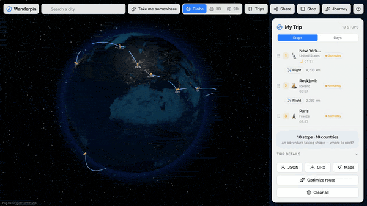

# Wanderpin

A trip planner that treats the *journey* as the product, not the spreadsheet.

Drop pins on a spinning night-earth, watch Wanderpin stitch them into a route, then hit play and fly the whole thing as a cinematic reel - gliding across the globe for long hops, dropping into real 3D terrain when two stops are close. Share it as a link, a postcard, or an embedded globe.

**Live:** https://wanderpin-ecru.vercel.app/



*Drop pins, build a route, hit play, and fly the whole journey across the globe.*

## The idea

Most trip planners bury you in logistics: kilometers, CO2, flight times, layovers. Wanderpin flips the hierarchy. The globe and the story are front and center; the numbers live in an opt-in "Trip details" drawer for when you actually want them. The goal is to make a trip feel like something worth taking before you've booked a thing.

## What you can do

- **Plan on a living globe.** A three.js night-earth with glowing pins and animated arcs between stops. Prefer flat? One toggle drops you into a 2D Leaflet map with a dashed route line.
- **Zoom straight into the world.** Keep zooming on a pin and the globe hands off to a full 3D view - real terrain, buildings, sky - powered by MapLibre. The 3D engine and its tiles warm up in the background first, so the switch is a crossfade, not a load flash. Zoom back out and it returns to the globe. Auto by default, manual toggle whenever you want it.
- **Add stops your way.** Search any city (geocoded via OpenStreetMap's Nominatim) or just click the map to drop a reverse-geocoded pin. Drag to reorder.
- **Take me somewhere.** Out of ideas? A curated set of destinations - each with a vibe and a fun fact - picks somewhere for you, drawn from a dataset of ~40k places (GeoNames cities + towns, UNESCO sites, Wikidata's most-visited, India-specific gems, Koppen climate, coastline).
- **Play the journey.** A Journey Reel flies through your route with captions. Short legs play in true 3D; long-haul trips stay on the globe - the whole reel commits to one engine so it never feels janky.
- **Share it, really share it.** Publish a public link, post the auto-composed postcard image, drop it into WhatsApp / Instagram / X, or grab an `<iframe>` embed of the live globe. Shared links open as a postcard intro, play the reel, then invite the viewer to make the journey their own. Rich link previews come from on-the-fly OG images.
- **It remembers.** Your trip and chosen view persist to localStorage; first-time visitors land on a sample Paris -> Rome -> Cairo route. Published trips live in Supabase and auto-expire after 7 days.

## Tech

- **React 19 + TypeScript**, built with **Vite 6**
- **Tailwind CSS v4** with shadcn/ui components on Radix
- **react-globe.gl / three.js** for the night-earth globe; **MapLibre GL** for 3D terrain + buildings; **react-leaflet** for the 2D map - all lazy-loaded
- **OpenStreetMap Nominatim** for geocoding (proxied, no API key), **@vercel/og** for share images
- **Supabase** (via PostgREST/fetch) for published trips, with a `pg_cron` 7-day TTL
- **lz-string** for shareable `#t=` hash state, **@dnd-kit** for reordering, **sonner** for toasts
- Vercel serverless `/api/*` + **Playwright** for screenshot/postcard composition

## Running locally

```bash
npm install
npm run dev      # start the dev server
npm run build    # type-check (tsc -b) and build for production
npm run preview  # preview the production build
```.

## Deploying

A static Vite SPA that deploys to Vercel with zero config - Vercel auto-detects the framework, runs `npm run build`, and serves `dist/`. The serverless functions in `api/` (geocode proxy, publish, OG images, share page) deploy alongside it. `vercel.json` handles SPA fallback and the `/t/:slug` + `/embed/:slug` rewrites.

To enable publishing/sharing, set `VITE_SUPABASE_URL`, `VITE_SUPABASE_PUBLISHABLE_KEY` (client, RLS-gated read) and a server-only secret key (never `VITE_`-prefixed) for `api/publish`.

## License

See [LICENSE](./LICENSE).
